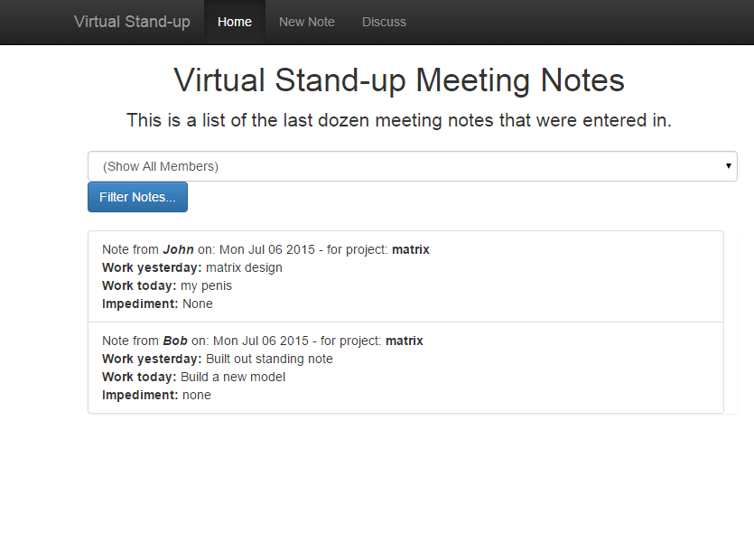
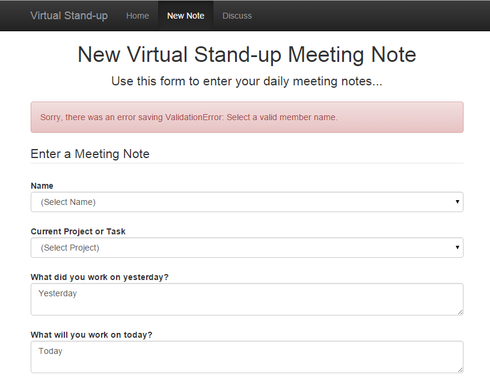

[Intro to Mongo + Node Course](http://www.pluralsight.com/courses/mongoose-for-nodejs-mongodb)

http://localhost:3000/newnote

- Create a virtual 'standup note app'
- Swig template (html)
- ? Auto creates collection 'standups'

- After adding newnotes.html you can pass data along to DB

#### Index Page

#### New Note

